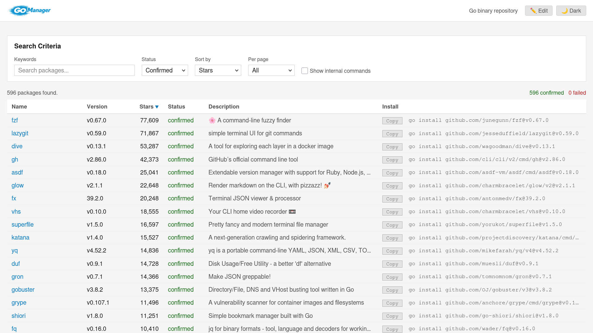

<p align="center">
  
</p>

A curated database of Go binaries with a CLI tool for searching, installing, and managing them.

GoManager automatically scans GitHub for Go CLI repositories, verifies they build with `go install`, and publishes the results to a SQLite database. A static web frontend and a Go CLI provide access to the catalog.

<p align="center">
  <picture>
    <source media="(prefers-color-scheme: dark)" srcset="assets/preview_dark.png" />
    <source media="(prefers-color-scheme: light)" srcset="assets/preview.png" />
    
  </picture>
</p>

## Install

```bash
go install github.com/jmelahman/gomanager/cmd/gomanager@latest
```

## Usage

```
gomanager search <query>             # Search by name, package, or description
gomanager install <name>             # Install a binary with go install
gomanager list                       # List installed binaries
gomanager upgrade <name>             # Upgrade a binary to the latest version
gomanager upgrade --all              # Upgrade all installed binaries
gomanager update-db                  # Download/update the binary database
```

## Admin tools

Database maintenance and CI commands live in a separate binary:

```bash
go install github.com/jmelahman/gomanager/cmd/gomanager-admin@latest
```

```
gomanager-admin scan -d ./database.db                # Scan GitHub for Go CLI repos
gomanager-admin verify -d ./database.db -n 20        # Verify builds
gomanager-admin verify -d ./database.db --reverify   # Retry failed packages
gomanager-admin verify -d ./database.db --recheck    # Re-verify updated packages
gomanager-admin update-versions -d ./database.db     # Check for new releases
gomanager-admin probe-roots -d ./database.db         # Discover root-level packages
gomanager-admin fix-module-paths -d ./database.db    # Fix v2+ module paths
gomanager-admin export pkgbuild <name>               # Generate an AUR PKGBUILD
```

## How it works

### Scanner (`gomanager-admin scan`)

Discovers Go CLI repositories on GitHub using multiple search queries. It detects binary entrypoints (`cmd/` directories, root `main.go`, goreleaser configs), reads `go.mod` to resolve v2+ module paths, and stores results in a SQLite database with metadata (stars, description, version). Already-scanned repositories are tracked in `scanned_repos.json` for incremental scanning.

Run it locally:

```bash
GITHUB_TOKEN=ghp_... gomanager-admin scan --database ./database.db
```

### Build verification (`gomanager-admin verify`)

Attempts `go install` on unverified packages and updates their build status. If a build fails, it retries with `CGO_ENABLED=0`. Each binary gets a status:

| Status      | Meaning                              |
| ----------- | ------------------------------------ |
| `confirmed` | Successfully built with `go install` |
| `failed`    | Build failed (error recorded)        |
| `regressed` | Build failed (previously confirmed)  |
| `unknown`   | Not yet tested                       |
| `pending`   | Queued for verification              |

### Web frontend (`index.html`)

A static single-page app that loads `database.db` with [sql.js](https://sql.js.org/). Features search, filtering by build status, sortable columns, copy-to-clipboard install commands, inline editing, and light/dark mode. Host it with GitHub Pages or any static file server.

To preview locally:

```bash
./serve
```

This starts a local HTTP server on the nearest available port (starting at 8000) and opens it in your browser.
